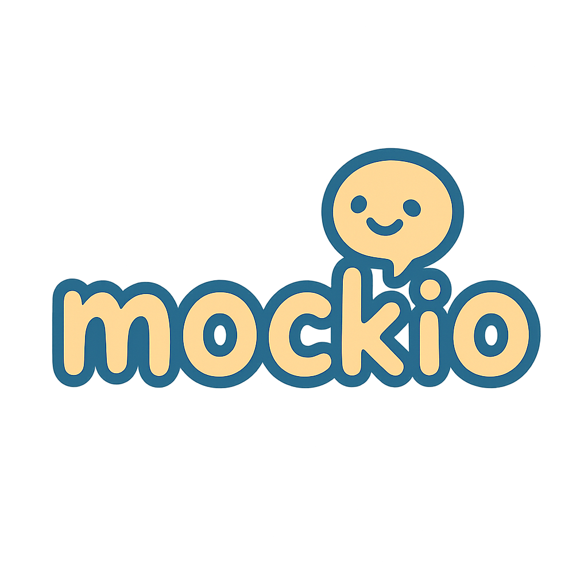

<h1 align="center">
    
       
<strong>mockio</strong> - AI 기반 모의 면접 플랫폼 💡
   
  <a href="https://mockio.cloud" target="_blank" rel="noopener noreferrer">https://mockio.cloud</a>
</h1>

    AI가 질문하고, 답변을 분석해 맞춤형 피드백을 제공하는 모의 면접 서비스입니다.

테스트 계정 : test@naver.com / test123!@#

---
## 📌 프로젝트 소개

mockio는 사용자가 실제 면접과 유사한 환경에서 답변을 연습하고,  
AI 기반 피드백을 통해 자신의 답변을 개선할 수 있는 인터뷰 시뮬레이션 서비스입니다.

>  실시간 질문 생성  
>  **답변 기반 AI 피드백 제공**  
>  인터뷰 흐름 관리 및 기록

---

## 📚 목차
- [⚙️ 로그인](./readme/login/readme.md)
- [📝️ 회원가입](./readme/join/readme.md)
- [🔐 비밀번호 찾기 / 재설정](./readme/remember/readme.md)
- [🏠 메인 페이지](./readme/main/readme.md)
- [📢 공지사항](./readme/notice/readme.md)
- [❓ 자주 묻는 질문 (FAQ)](./readme/faq/readme.md)
- [🎤 AI 면접 진행 흐름](./readme/interviewing/readme.md)
- [📊 면접 내역](./readme/interviewResult/readme.md)
- [📊 면접 기록 & 성장 추적](./readme/interviewhistory/readme.md)
- [👤 내 정보 / 면접 설정](./readme/usersecurity/readme.md)
- [🔐 보안 설정 ](./readme/usersetting/readme.md)
