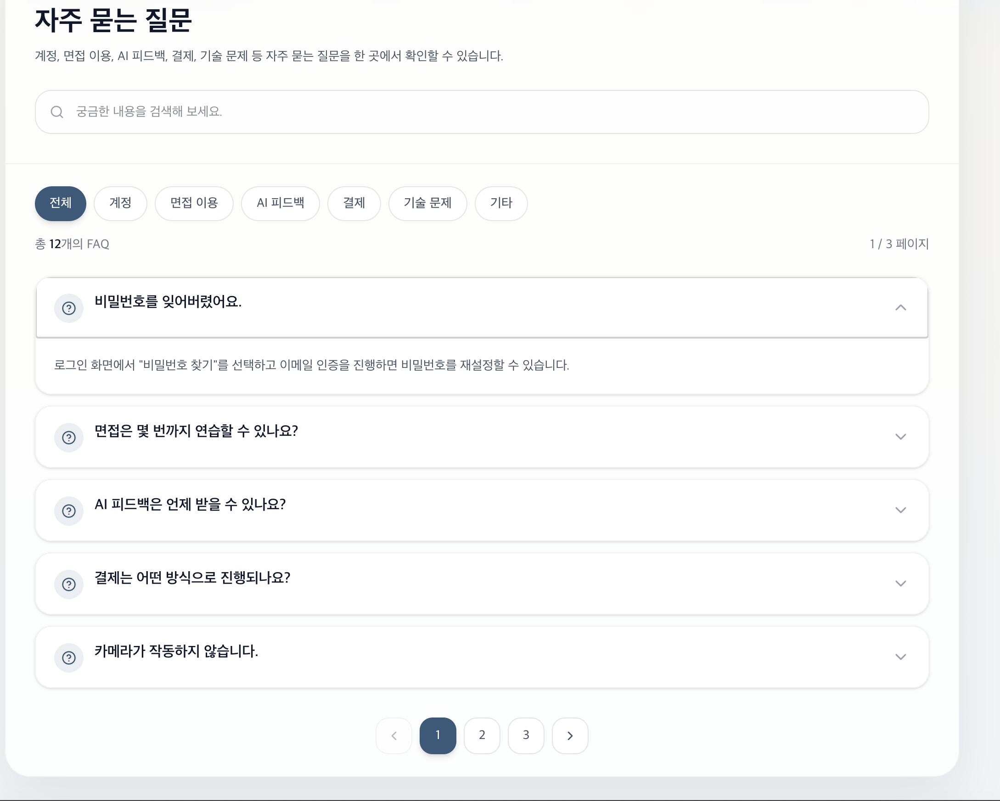

## ❓ 자주 묻는 질문 (FAQ)

[🔝 메인 목차로 이동](../../readme.md)

사용자가 자주 궁금해하는 질문과 답변을 한 곳에서 확인할 수 있는 페이지입니다.  
계정, 면접 이용, AI 피드백, 결제, 기술 문제 등 다양한 주제를 카테고리별로 제공합니다.

---

## 🔍 주요 기능

### 1. 검색 기능
- 키워드 입력으로 FAQ 빠른 검색
- 원하는 정보를 즉시 탐색 가능

---

### 2. 카테고리 필터
FAQ를 주제별로 분류하여 제공합니다.

- 전체
- 계정
- 면접 이용
- AI 피드백
- 결제
- 기술 문제
- 기타

👉 카테고리 선택 시 해당 항목만 필터링

---

### 3. FAQ 목록 (아코디언 UI)

질문 클릭 시 답변이 펼쳐지는 구조로 구성되어 있습니다.

#### 특징
- 기본은 접힌 상태
- 클릭 시 답변 확장
- 한 화면에서 여러 질문 탐색 가능

---

### 4. 페이지네이션

- FAQ 개수에 따라 페이지 분리
- 현재 페이지 / 전체 페이지 표시
- 페이지 이동 버튼 제공

---