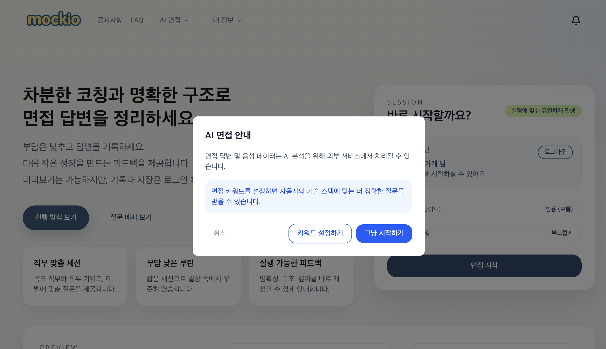
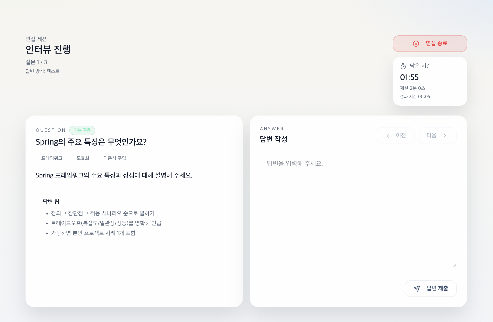
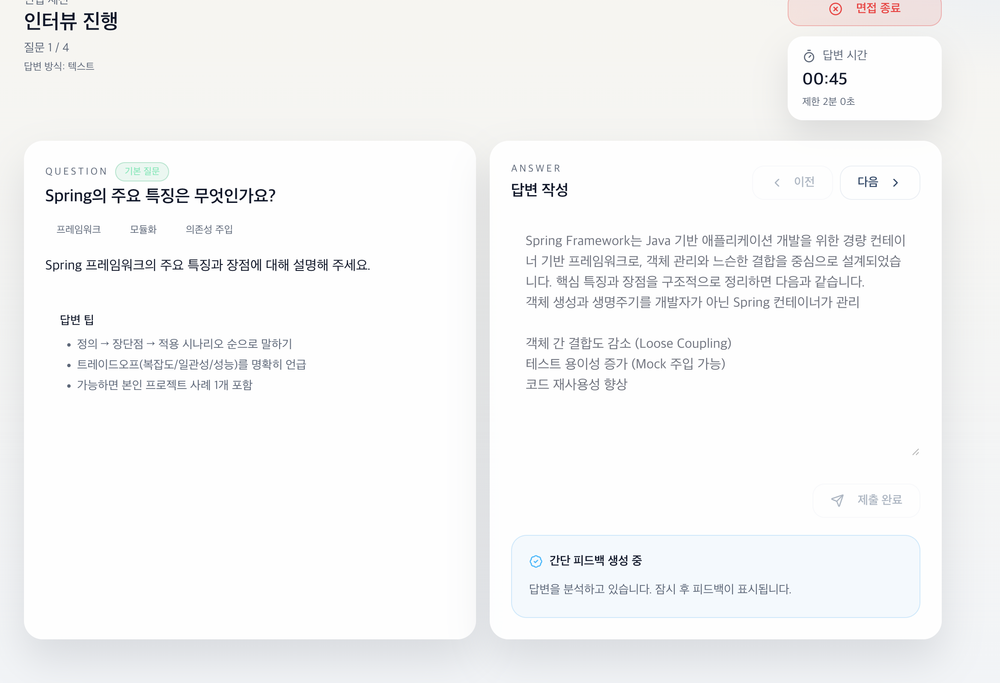
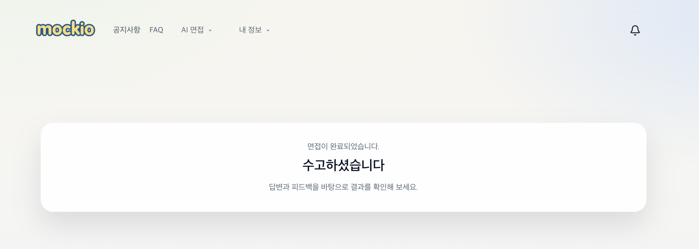

## 🎤 AI 면접 진행 흐름

[🔝 메인 목차로 이동](../../readme.md)

사용자가 AI 기반 모의 면접을 진행하고, 답변에 대한 피드백을 받는 전체 흐름입니다.  
면접 질문 생성부터 답변 작성, 피드백 제공까지 하나의 사이클로 구성되어 있습니다.

---

## 1️⃣ 면접 시작 안내

사용자가 면접을 시작하기 전에 안내 모달을 통해 진행 방식을 확인합니다.

### 주요 기능
- AI 분석 안내 (텍스트/음성 데이터 처리 안내)
- 면접 키워드 설정 선택 가능
- 바로 시작 또는 맞춤 설정 선택

---

## 2️⃣ 질문 생성 (Loading)

면접 시작 시 AI가 질문을 생성합니다.

### 특징
- 사용자 설정 기반 질문 생성
- 로딩 UI로 진행 상태 안내

---

## 3️⃣ 면접 진행 (질문 & 답변)

AI가 질문을 제시하고, 사용자가 답변을 작성합니다.

### 구성
- 질문 영역 (QUESTION)
- 답변 입력 영역 (ANSWER)
- 남은 시간 표시
- 이전 / 다음 질문 이동

### 특징
- 타이머 기반 답변 제한
- 단계별 질문 진행 (예: 1/N)
- 면접 종료 버튼 제공

---

## 4️⃣ 답변 제출 및 분석

답변을 제출하면 AI가 내용을 분석합니다.

### 특징
- 답변 내용 기반 분석
- 피드백 생성 중 상태 표시

---

## 5️⃣ 피드백 제공

AI가 답변에 대한 평가와 개선 방향을 제공합니다.

### 제공 정보
- 점수 (예: 70점)
- 잘한 점
- 보완할 점
- 개선 방향 및 예시 답변

---

## 6️⃣ 추가 질문 (Follow-up)

이전 답변을 기반으로 추가 질문이 이어질 수 있습니다.

### 특징
- 맥락 기반 심화 질문
- 실제 면접과 유사한 흐름 구성

---

## 7️⃣ 면접 종료

모든 질문이 끝나면 면접이 종료됩니다.

### 안내
- 면접 완료 메시지 표시
- 결과 및 피드백 확인 유도
- 알림 으로 피드백 유도

---