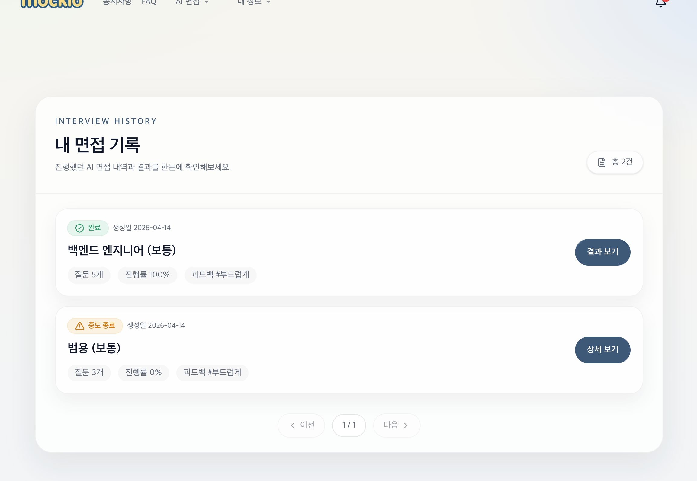
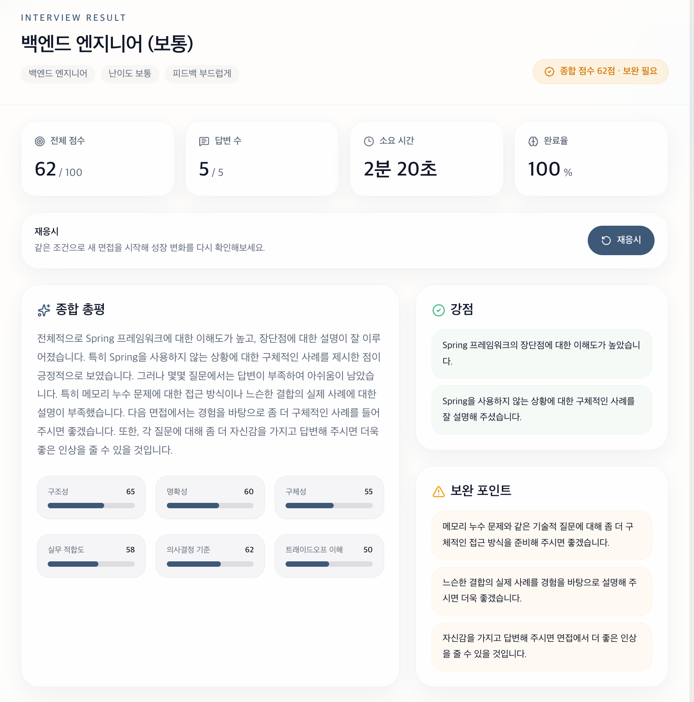
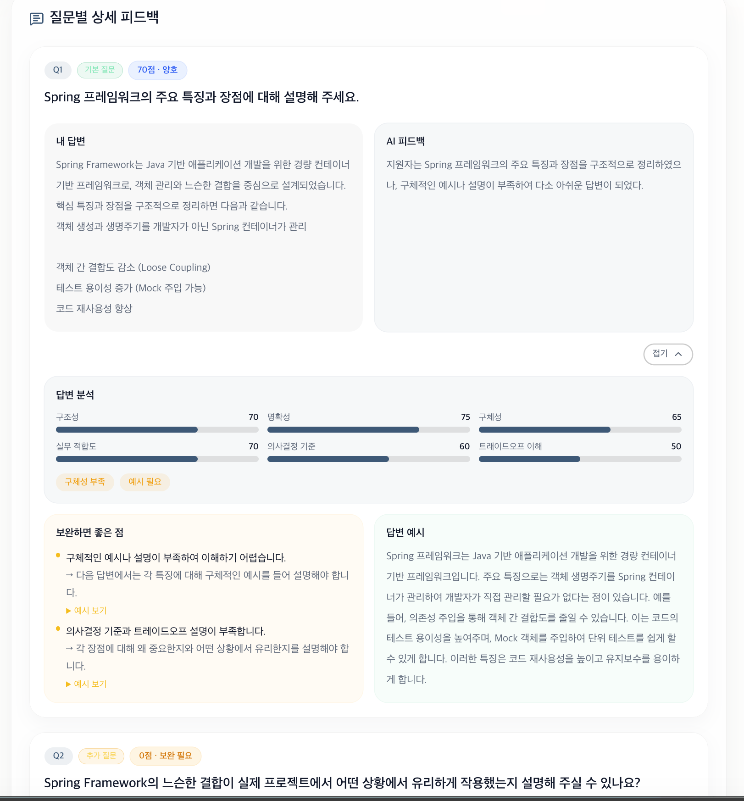
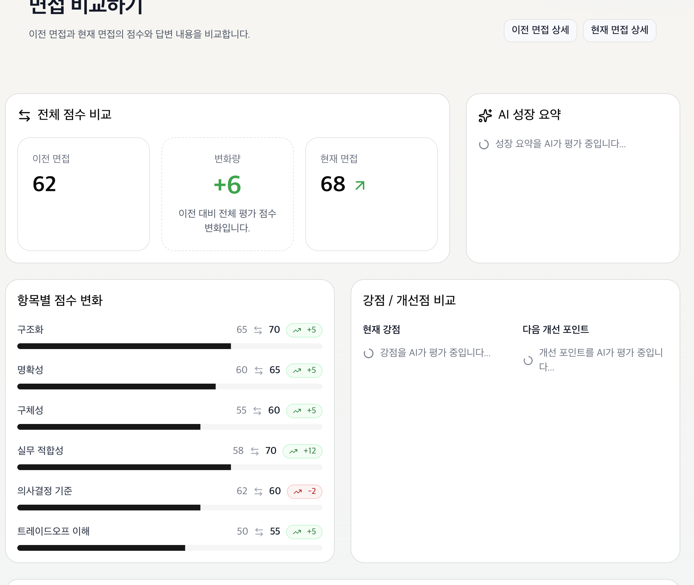
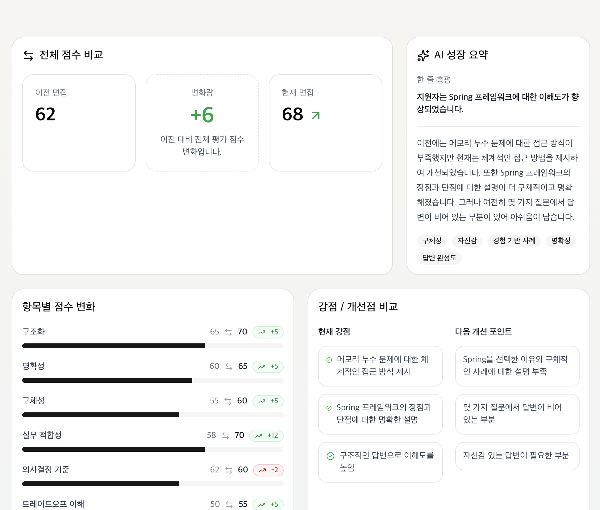
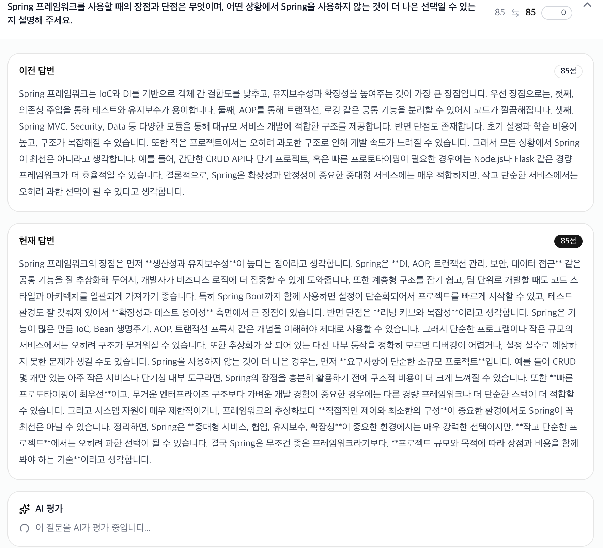
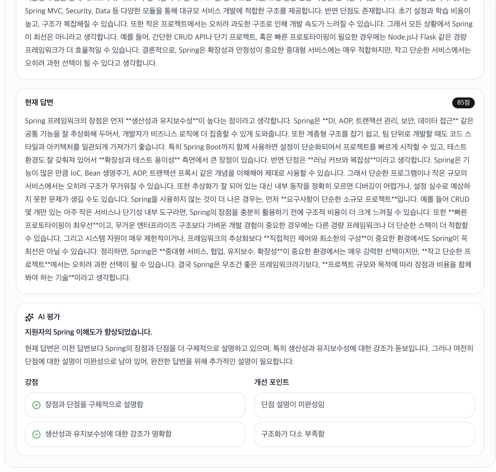

## 📊 면접 내역 (Interview History)

[🔝 메인 목차로 이동](../../readme.md)

사용자가 진행한 AI 면접 기록과 결과를 확인할 수 있는 페이지입니다.  
면접 진행 상태, 점수, 피드백을 한눈에 확인하고, 상세 분석을 통해 개선 방향을 파악할 수 있습니다.

---

## 1️⃣ 면접 기록 목록

사용자가 진행한 면접 목록을 확인할 수 있습니다.



### 제공 정보
- 면접 상태 (완료 / 중도 종료)
- 생성일
- 직무 및 난이도
- 질문 수
- 진행률
- 피드백 스타일

### 주요 기능
- 결과 보기 / 상세 보기 버튼
- 페이지네이션 지원
- 전체 면접 개수 표시

---

## 2️⃣ 면접 결과 요약

선택한 면접의 전체 결과를 요약하여 제공합니다.



### 제공 정보
- 총 점수 (예: 62점)
- 답변 수
- 소요 시간
- 완료율

### 추가 기능
- 재응시 기능 (동일 조건으로 재면접)
- 직무 / 난이도 / 피드백 스타일 표시

---

## 3️⃣ 종합 피드백

AI가 면접 전체에 대한 종합적인 평가를 제공합니다.

### 구성
- 종합 총평
- 강점
- 보완 포인트

### 특징
- 구조적 피드백 제공
- 개선 방향 명확화
- 다음 면접 준비 가이드 역할

---

## 4️⃣ 질문별 상세 피드백

각 질문에 대한 개별 분석 결과를 확인할 수 있습니다.



### 제공 정보
- 질문 내용
- 사용자 답변
- AI 피드백
- 점수 (예: 70점)

---

## 5️⃣ 답변 분석 지표

답변을 다양한 기준으로 정량적으로 평가합니다.

### 평가 항목
- 구조성
- 명확성
- 구체성
- 실무 적합도
- 의사결정 기준
- 트레이드오프 이해

👉 각 항목별 점수 및 그래프 제공

---

## 6️⃣ 개선 가이드 및 예시 답변

사용자의 답변을 보완하기 위한 가이드를 제공합니다.

### 포함 내용
- 부족한 부분 설명
- 개선 방향 제시
- 예시 답변 제공

👉 학습 효과 극대화


## 🔄 사용자 흐름

```text
면접 내역 진입
 → 면접 목록 확인
 → 특정 면접 선택
 → 결과 요약 확인
 → 종합 피드백 확인
 → 질문별 상세 분석 확인
 → 개선 후 재응시
```
---

## 🔄 면접 비교 (Interview Compare)

이전 면접과 현재 면접의 결과를 비교하여 성장 여부를 분석하는 기능입니다.  
점수 변화뿐 아니라, 항목별 개선 정도와 AI 기반 성장 피드백을 제공합니다.

---

## 1️⃣ 전체 점수 비교



### 제공 정보
- 이전 면접 점수
- 현재 면접 점수
- 점수 변화량 (▲ / ▼)

### 특징
- 한눈에 성장 여부 파악 가능
- 직관적인 상승/하락 표시
- 성장 요약은 ai 호출 후 확인 가능

---

## 2️⃣ 항목별 점수 변화


### 비교 항목
- 구조성
- 명확성
- 구체성
- 실무 적합성
- 의사결정 기준
- 트레이드오프 이해

### 특징
- 항목별 점수 증감 표시 (+ / -)
- 어떤 역량이 개선되었는지 명확히 확인 가능

---

## 3️⃣ AI 성장 요약



### 제공 내용
- 한 줄 총평
- 이전 대비 개선된 부분
- 부족한 부분 분석

### 특징
- 단순 점수가 아닌 **맥락 기반 성장 평가**
- 실제 면접 피드백처럼 자연스러운 코멘트 제공

---

## 4️⃣ 강점 / 개선 포인트 비교

### 구성
- 현재 강점
- 다음 개선 포인트

### 특징
- 이전 대비 **잘한 점 vs 보완할 점** 명확 분리
- 다음 면접 준비 방향 제시

---

## 5️⃣ 답변 비교 (Before / After)




### 제공 정보
- 이전 답변
- 현재 답변
- 점수 변화

### 특징
- 실제 답변 개선 과정 확인 가능
- 자기 피드백 학습 효과 극대화

