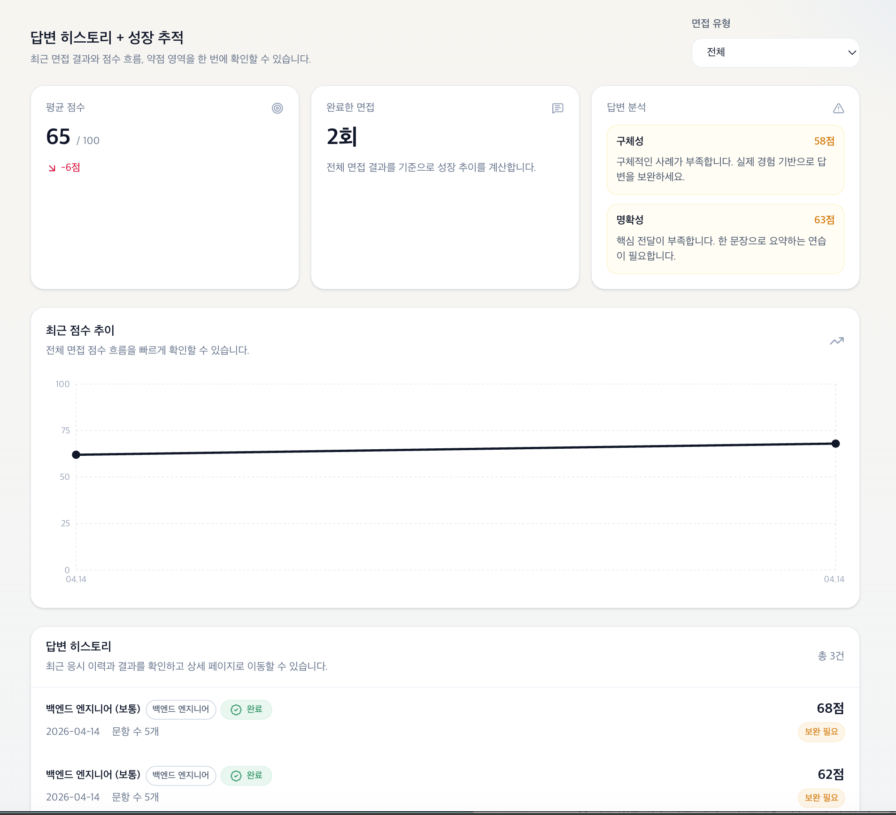

## 📊 면접 기록 & 성장 추적 (Interview Dashboard)

[🔝 메인 목차로 이동](../../readme.md)

사용자의 면접 결과를 기반으로 점수 변화, 약점 영역, 성장 흐름을 한눈에 확인할 수 있는 분석 페이지입니다.  
단순 기록을 넘어 **지속적인 성장 추적**을 목표로 설계되었습니다.

## 1️⃣ 핵심 요약 카드

### 제공 정보
- 평균 점수
- 점수 변화 (▲ / ▼)
- 완료한 면접 횟수
- 주요 약점 분석

### 특징
- 현재 상태를 빠르게 파악 가능
- 성과와 문제 영역을 동시에 제공

---

## 2️⃣ 답변 분석 (Weak Point Insight)

### 분석 항목
- 구체성
- 명확성
- 기타 평가 요소

### 특징
- 점수 + 피드백 함께 제공
- 단순 수치가 아닌 개선 방향 제시

---

## 3️⃣ 최근 점수 추이

### 제공 기능
- 날짜별 점수 변화 그래프
- 면접 성과 흐름 시각화

### 특징
- 성장 여부를 직관적으로 확인
- 학습 효과 추적 가능

---

## 4️⃣ 답변 히스토리

### 제공 정보
- 면접 직무 / 난이도
- 진행 상태 (완료 / 중도 종료)
- 질문 개수
- 최종 점수

### 특징
- 과거 면접 기록 조회
- 상세 결과 페이지로 이동 가능

---