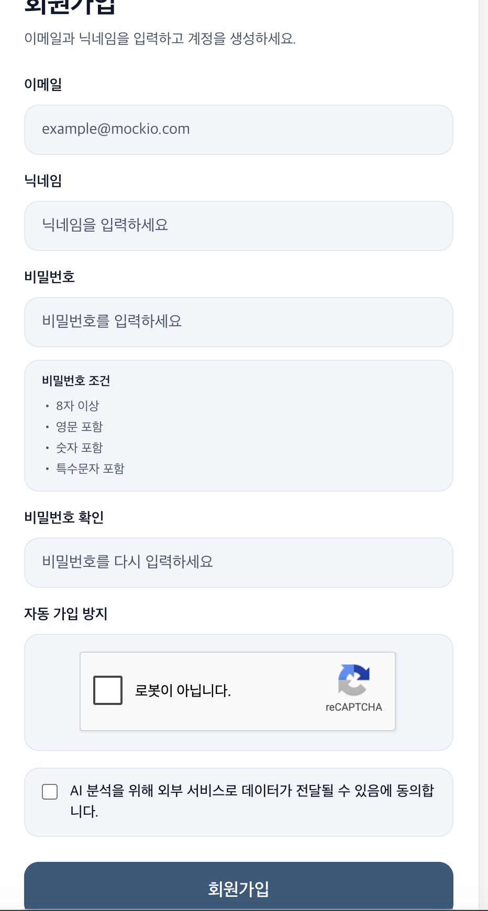

## 📝 회원가입

[🔝 메인 목차로 이동](../../readme.md)

📖 개요

사용자는 이메일, 닉네임, 비밀번호를 입력하여 계정을 생성할 수 있습니다.
회원가입 시 입력값 검증 및 보안 요소를 적용하여 안전한 계정 생성을 지원합니다.
---

🔑 주요 기능
- 이메일 / 닉네임 / 비밀번호 기반 회원가입
- 비밀번호 조건 검증
- 8자 이상
- 영문 포함
- 숫자 포함
- 특수문자 포함
- 비밀번호 확인 (일치 여부 검증)
- Google reCAPTCHA를 통한 자동 가입 방지
- AI 데이터 활용 동의 체크 기능

🔄 동작 흐름
1. 사용자가 이메일, 닉네임, 비밀번호 입력 
2. 비밀번호 조건 충족 여부 실시간 검증
3. 비밀번호 확인 입력 → 일치 여부 체크
4. reCAPTCHA 인증 수행
5. 약관(데이터 활용 동의) 체크
6. 서버로 회원가입 요청
7. 회원 생성 성공 시 로그인 페이지 또는 메인 페이지 이동

✔ 보안
- reCAPTCHA 적용
- 자동화된 봇 가입 방지
- 비밀번호 정책 강화
- 단순 비밀번호 사용 방지
- 서버 측 검증
- 클라이언트 우회 공격 방어