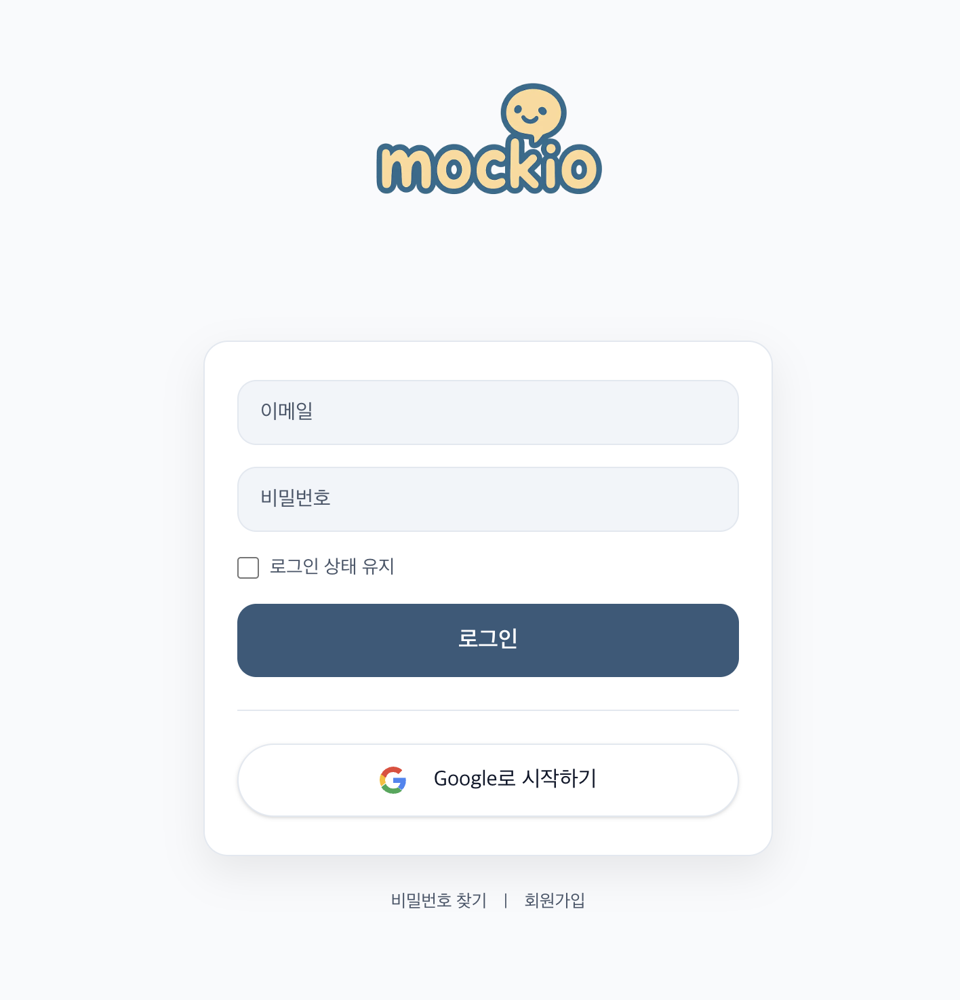

## ⚙️ 로그인

[🔝 메인 목차로 이동](../../readme.md)

### 📖 개요

사용자는 이메일/비밀번호 또는 Google OAuth를 통해 서비스를 이용할 수 있습니다.
JWT 기반 인증을 사용하여 로그인 상태를 유지하며, 토큰 만료 시 자동 재발급이 이루어집니다.
---

🔑 주요 기능
- 이메일 / 비밀번호 로그인
- 로그인 상태 유지 옵션 (Remember Me)
- Google OAuth 로그인 지원
- JWT 기반 인증 (Access Token + Refresh Token)
- 토큰 만료 시 자동 재발급 (Interceptor 기반)

🔄 동작 흐름
1. 사용자가 이메일과 비밀번호 입력 후 로그인 요청
2. 서버에서 인증 성공 시 Access Token 발급
3. 클라이언트는 토큰을 저장하고 API 요청 시 Authorization 헤더에 포함
4. 토큰 만료 시 Refresh Token을 통해 자동 재발급
5. 재발급 실패 시 로그인 페이지로 이동

🧩 기술 포인트
- Axios Interceptor
  - 요청 시 자동으로 Access Token 추가
  - 401 발생 시 Refresh Token으로 재요청 처리
- JWT 인증 구조
  - Access Token: 짧은 수명
  - Refresh Token: 쿠키 기반 관리
- 보안
  - HttpOnly 쿠키 사용 (Refresh Token)
  - 인증 실패 시 즉시 로그아웃 처리