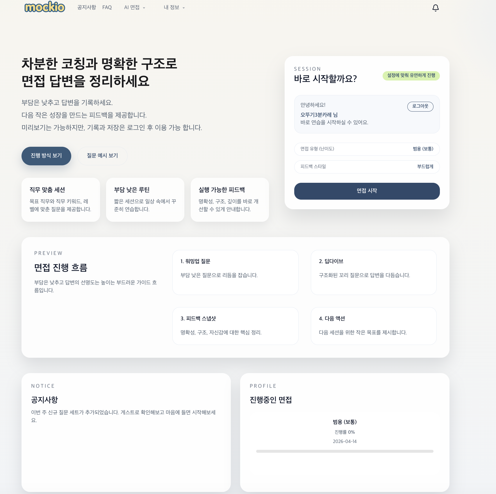
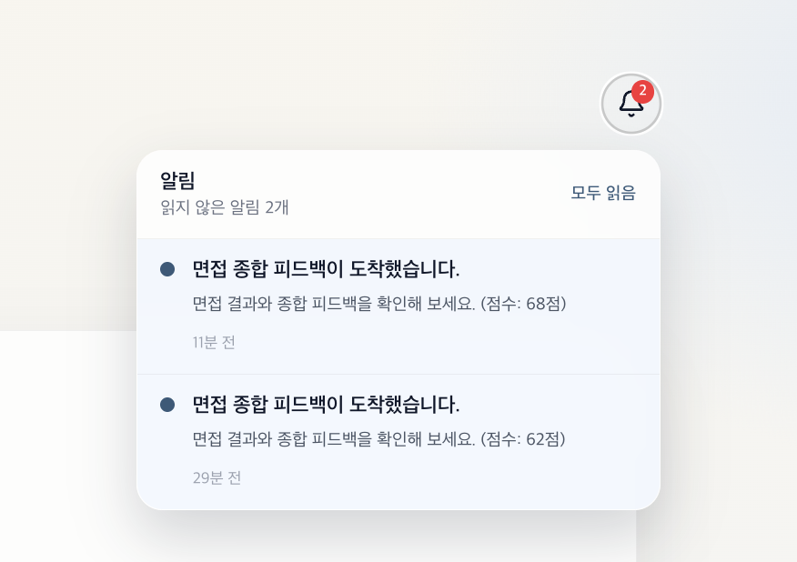

## 🏠 메인 페이지

[🔝 메인 목차로 이동](../../readme.md)

AI 기반 모의 면접 서비스의 시작 화면으로,  
사용자가 빠르게 면접을 시작하거나 전체 흐름을 이해할 수 있도록 설계된 페이지입니다.

면접 진행 방식, 피드백 구조, 현재 상태 등을 한 눈에 확인할 수 있으며  
초기 진입 장벽을 낮추고 자연스럽게 면접 세션으로 이어지도록 구성되어 있습니다.



---

## 🎯 주요 기능

### 1. 빠른 면접 시작
- 로그인 상태에서 즉시 면접 세션 시작 가능
- 기본 설정 기반으로 빠른 진입 지원
- 비로그인 시 게스트 체험 안내 제공

---

### 2. 맞춤형 세션 안내
- 면접 유형 (난이도)
- 피드백 스타일 (부드럽게 / 명확하게 등)
- 사용자 설정 기반으로 세션 구성

---

### 3. 면접 흐름 미리보기
면접 진행 구조를 사전에 안내하여 사용자 부담을 줄입니다.

#### 진행 단계
1. 워밍업 질문
2. 딥다이브 질문
3. 피드백 스냅샷
4. 다음 액션 제안

---

### 4. 핵심 가치 제시
- ✔️ 직무 맞춤 질문 제공
- ✔️ 부담 없는 루틴 기반 학습
- ✔️ 실행 가능한 피드백 제공

---

### 5. 사용자 상태 표시
- 진행 중인 면접 확인
- 진행률 표시
- 최근 세션 정보 제공

---

### 6. 공지사항
- 새로운 질문 세트
- 업데이트 내용 안내
- 사용자에게 필요한 최신 정보 제공

---


### 6. 알림목록
- 면접 종료 후 피드백 완료 시 생성
- 클릭 시 면접 피드백 화면 이동

---

## 🔄 사용자 흐름

```text
메인 진입
 → 면접 설정 확인
 → 면접 시작 클릭
 → AI 면접 진행
 → 피드백 확인