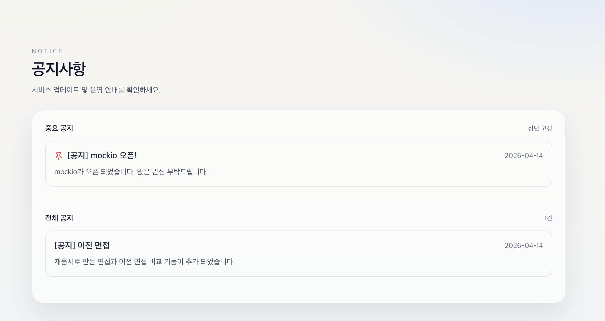
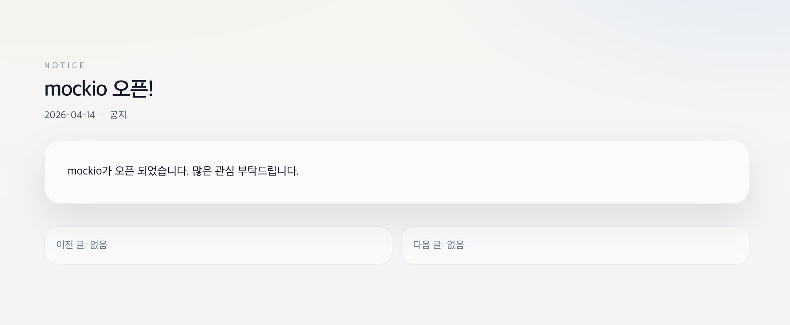

## 📢 공지사항

[🔝 메인 목차로 이동](../../readme.md)

서비스 운영 공지, 업데이트 안내, 주요 변경사항을 사용자에게 전달하는 페이지입니다.  
공지 목록 조회와 상세 확인이 가능하며, 이전/다음 글 탐색 기능을 제공합니다.

---

## 📄 공지사항 목록

전체 공지사항을 한 눈에 확인할 수 있는 페이지입니다.  
현재 등록된 공지 개수와 함께 목록을 제공합니다.

### 주요 기능
- 전체 공지 목록 조회
- 공지 개수 표시
- 공지 클릭 시 상세 페이지 이동

---

## 📄 공지사항 상세

선택한 공지의 상세 내용을 확인할 수 있습니다.  
공지 제목, 작성일, 내용 정보를 제공합니다.

### 제공 정보
- 공지 제목
- 작성일
- 공지 유형 (공지 / 이벤트 등)
- 공지 본문 내용

---

## 🔄 네비게이션 기능

이전 글 / 다음 글 이동 기능을 통해  
연속적으로 공지를 탐색할 수 있습니다.

- 이전 글이 없는 경우: "이전 글 없음" 표시
- 다음 글이 없는 경우: "다음 글 없음" 표시

