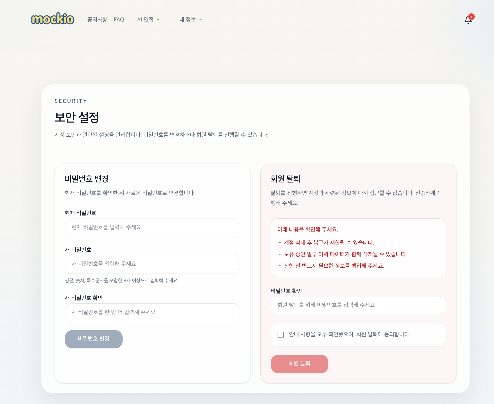

## 🔐 보안 설정 (Security Settings)

[🔝 메인 목차로 이동](../../readme.md)

사용자의 계정 보안을 관리하는 페이지입니다.  
비밀번호 변경과 회원 탈퇴 기능을 제공하며, 민감한 작업에 대한 안전 장치를 포함하고 있습니다.

## 1️⃣ 비밀번호 변경

### 제공 기능
- 현재 비밀번호 확인
- 새 비밀번호 입력
- 새 비밀번호 확인 입력

### 검증 조건
- 최소 8자 이상
- 영문 / 숫자 / 특수문자 포함

### 특징
- 기존 비밀번호 검증 후 변경 가능
- 입력값 일치 여부 확인
- 사용자 실수 방지를 위한 이중 입력 구조

---

## 2️⃣ 회원 탈퇴

### 제공 기능
- 비밀번호 재확인
- 탈퇴 동의 체크
- 계정 삭제 실행

---

### ⚠️ 안내 사항

- 계정 삭제 후 복구가 제한될 수 있음
- 일부 면접 기록 및 데이터가 삭제될 수 있음
- 진행 전 데이터 백업 권장

---

### 특징
- 민감 작업에 대한 **이중 검증 구조**
- 사용자에게 충분한 경고 제공
- 실수로 인한 탈퇴 방지 UX

---

## 🧠 보안 설계 포인트

- **재인증 요구**
  → 비밀번호 입력을 통한 사용자 검증

- **위험 작업 분리**
  → 비밀번호 변경 / 탈퇴 UI 분리

- **Soft Delete 고려 가능**
  → 즉시 삭제 대신 논리 삭제 기반 설계 가능

- **사용자 보호 UX**
  → 경고 메시지 + 체크박스 확인

---
