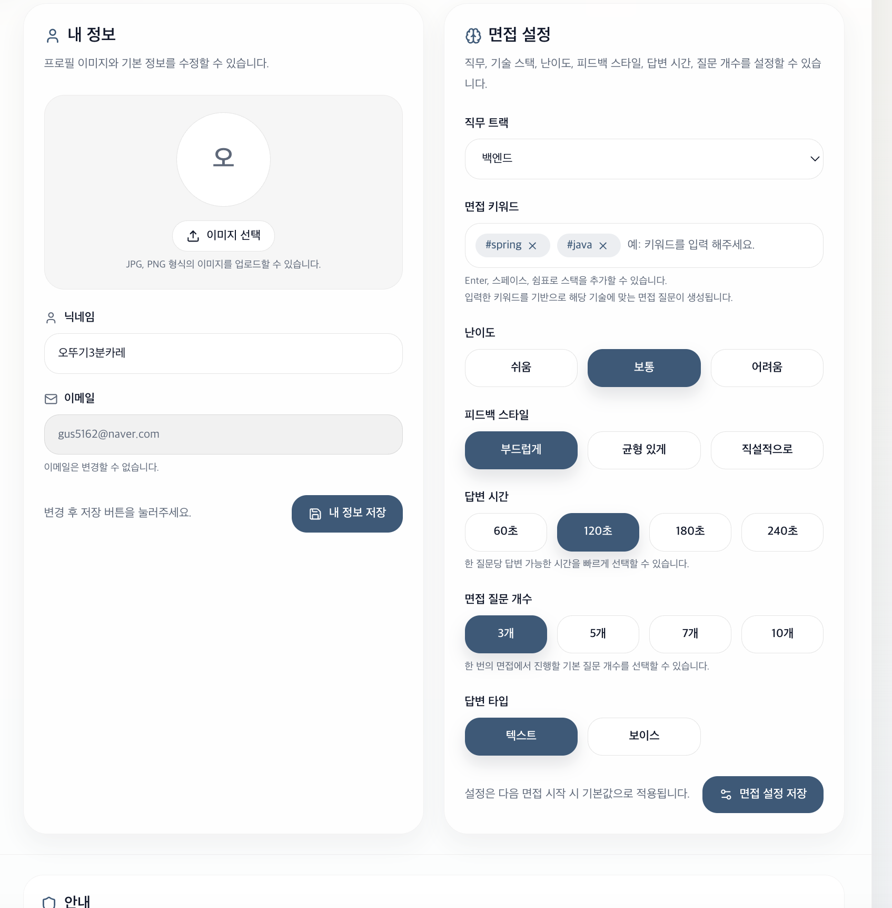

## 👤 내 정보 / 면접 설정 (My Page)

[🔝 메인 목차로 이동](../../readme.md)

사용자의 프로필 정보와 면접 설정을 관리하는 페이지입니다.  
면접 경험을 개인화하고, 원하는 방식으로 인터뷰를 진행할 수 있도록 지원합니다.

## 1️⃣ 프로필 정보 관리

### 제공 기능
- 프로필 이미지 업로드
- 닉네임 수정
- 이메일 조회 (읽기 전용)

### 특징
- 간단한 UI로 빠른 정보 수정 가능
- 이메일은 인증 기반으로 변경 제한

---

## 2️⃣ 면접 설정

사용자의 목적과 수준에 맞는 맞춤형 면접을 구성할 수 있습니다.

---

### 🔹 직무 트랙 선택
- 백엔드 / 프론트엔드 등 선택 가능
- 선택한 트랙 기반으로 질문 생성

---

### 🔹 면접 키워드 설정
- 예: `#spring`, `#java`
- 입력 키워드를 기반으로 **맞춤 질문 생성**

### 특징
- 기술 스택 기반 인터뷰
- 실무 중심 질문 유도

---

### 🔹 난이도 설정
- 쉬움 / 보통 / 어려움

### 특징
- 사용자 수준에 맞는 질문 난이도 제공

---

### 🔹 피드백 스타일
- 부드럽게 / 균형 있게 / 직설적으로

### 특징
- 사용자 성향에 맞춘 AI 피드백 제공

---

### 🔹 답변 시간 설정
- 60초 / 120초 / 180초 / 240초

### 특징
- 실전 면접 환경 시뮬레이션 가능

---

### 🔹 면접 질문 개수
- 3개 / 5개 / 7개 / 10개

### 특징
- 짧은 연습부터 깊이 있는 인터뷰까지 지원

---

### 🔹 답변 타입
- 텍스트 / 보이스

### 특징
- 다양한 인터뷰 환경 대응 (타이핑 vs 실전 말하기)

---

## 💾 설정 저장

- “내 정보 저장” → 프로필 정보 반영
- “면접 설정 저장” → 다음 면접에 기본값으로 적용

---